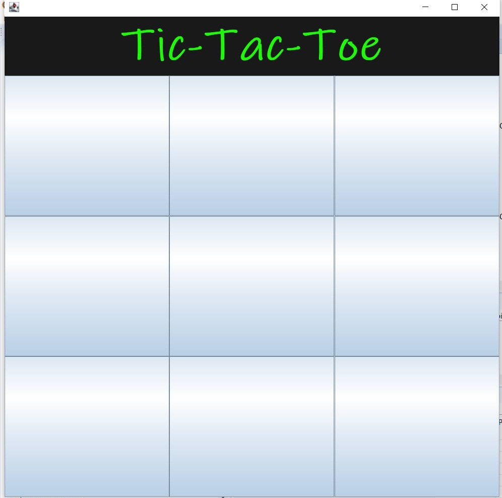
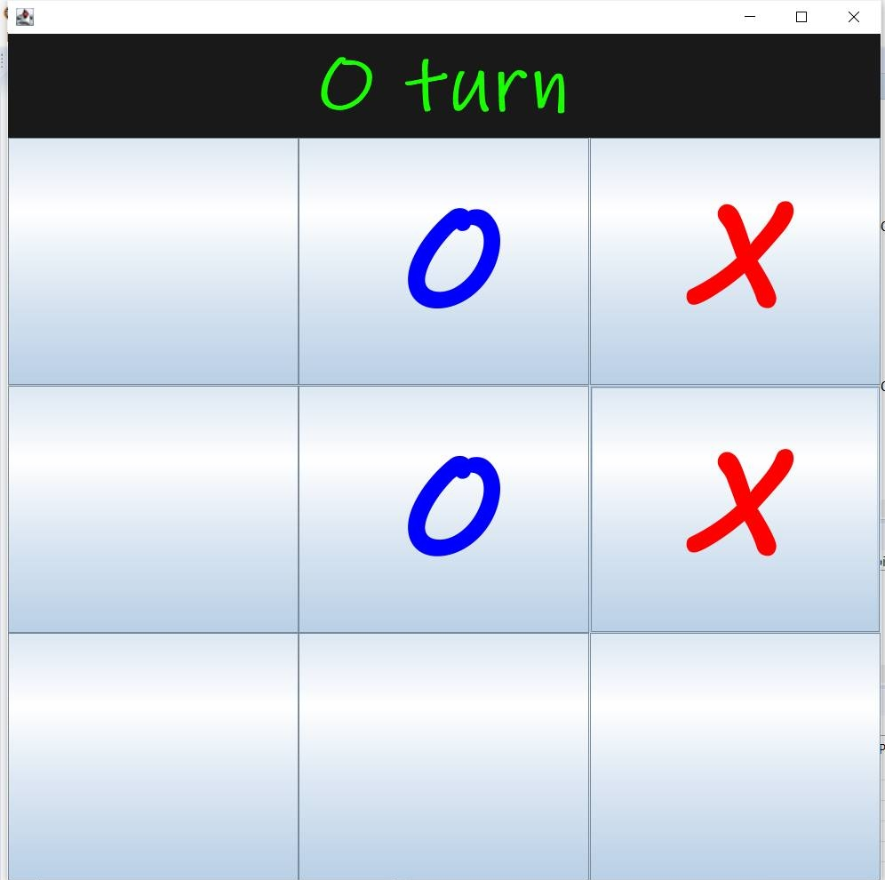
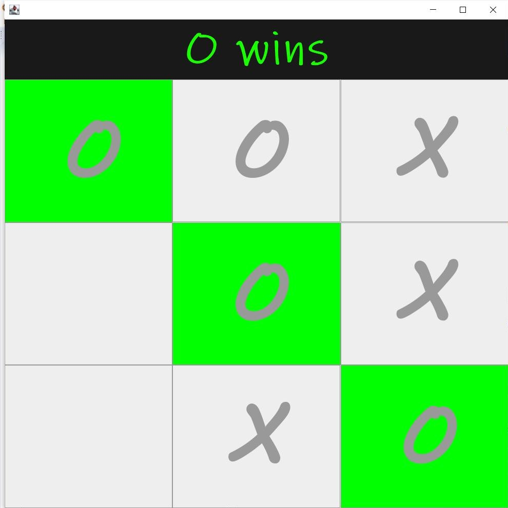
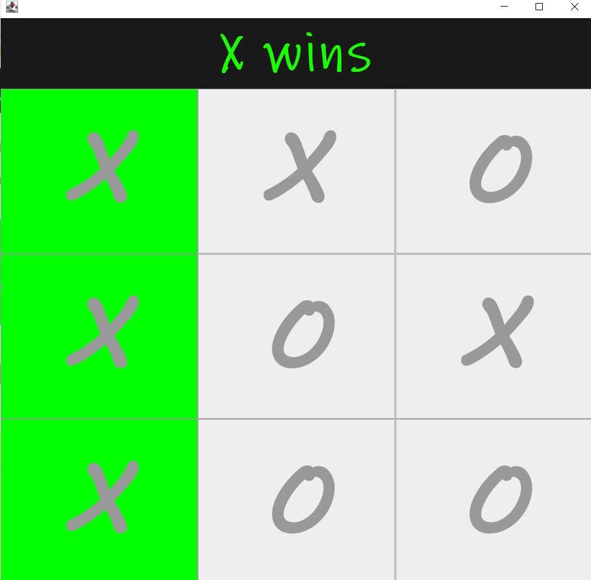
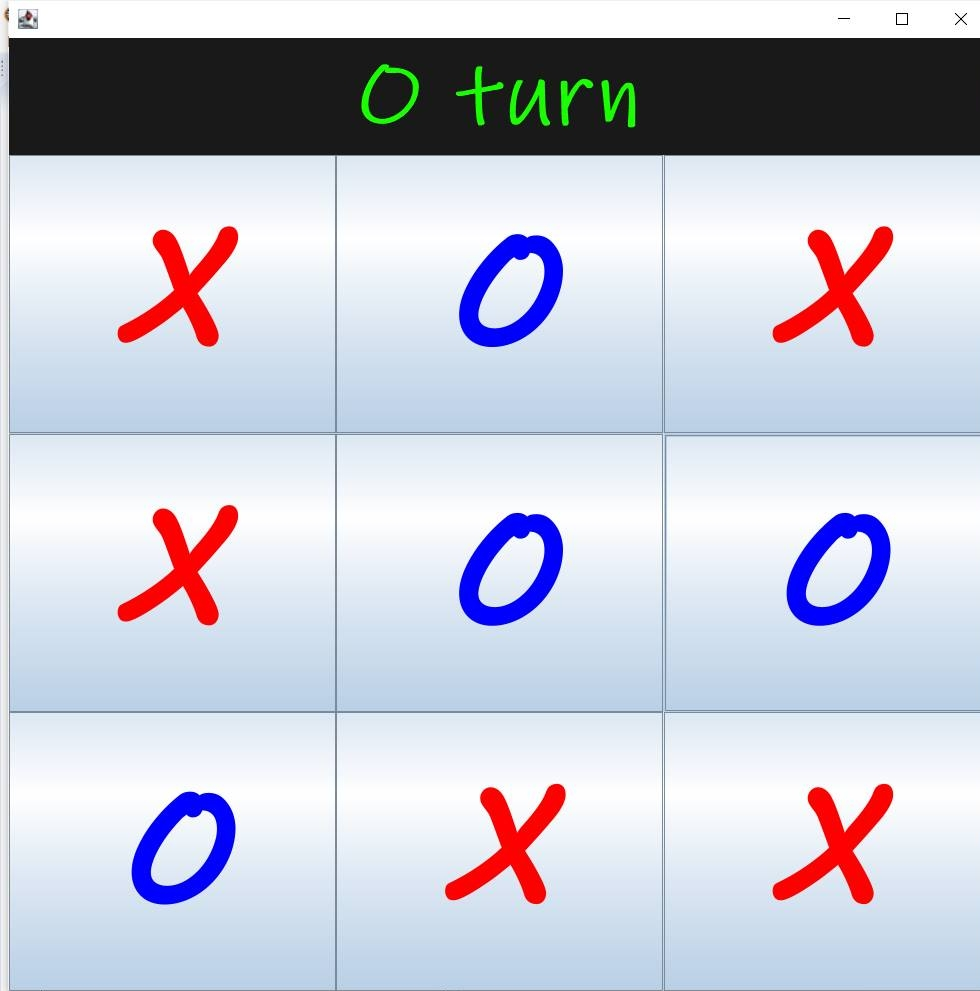

# Tic-Tac-Toe-II

# About

This project is a Tic Tac Toe board that users can play on Eclispe IDE
        
This project allows 2 players to play Tic Tac Toe

The game will randomly assign 'X' or 'O' to have the first turn 

The first player to get three in a row for 'O' or 'X' wins the game

If no player gets three in a row, then the game will have to be restarted

# Documentation

This project is done using Java

There are two public classes created: TicTacToe and Main

In the TicTacToe public class a Java ActionListener interface was implemented

Within this interface, a Random class, JFrame class, JPanel class for the title and button,
JLabel class, JButton array, and a boolean. 
                        
Furthermore, a constructor TicTacToe() and five methods are found within the TicTacToe public class. The five methods are actionPerformed, firstTurn, check, XWins, OWins
                        
A constructor TicTacToe() is created and within that contains setting up the title panel,
buttons, and the frame. This is done by using setters, for loops, and arrays. Then the firstTurn
method was called.

actionPerformed is a method where the user can interact with the Tic Tac Toe board and
within that method  contains for loops and if/else statements.
                        
firstTurn is a method that decides randomly whether or not 'O' or 'X' goes first. Within this method contains a try/catch statement and if/else statements. 
                            
check is a method that checks which user wins the game and is calling either XWins or OWins. Within this method contains if/else statements, arrays, and methods.
                        
XWins method checks that the X player wins and it takes in three paremeters of integers. Within this method contains arrays and for loops.
                            
OWins method checks that the O player wins and it takes in three parameters of integers. Wtihin this method contains arrays and for loops.

In order to start the game the user must click on the play button in Eclispe.

# When user starts game initially 

# When users is playing the game

# When it is 'O' wins the game

# When it is 'X' wins the game

# When the game ends in a draw

